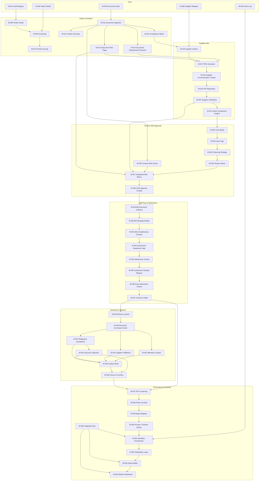

# Карта зависимостей модулей и MVP-ядро первой волны

> Reconciliation note:
> this dependency map is preserved as a historical architecture/implementation snapshot.
> It does not override the locked canonical registry in [canonical_module_registry_locked.md](/Users/master/Documents/AI-Corporation/docs/99_governance/canonical_module_registry_locked.md).
> For current governance status and drift analysis, use [canonical_vs_implemented_mapping.md](/Users/master/Documents/AI-Corporation/docs/99_governance/canonical_vs_implemented_mapping.md) and [non_canonical_extension_register.md](/Users/master/Documents/AI-Corporation/docs/99_governance/non_canonical_extension_register.md).

## 1. Назначение документа

Этот документ нужен, чтобы:
- увидеть **архитектуру не списком, а как граф**;
- понять, какие модули являются **ядром**, а какие — надстройкой;
- зафиксировать **MVP-последовательность первой волны**;
- не потерять связи между ветками системы во время разработки.

---

## 2. Главный принцип

Мы строим систему не “по отдельным хотелкам”, а как **процессовую машину**.

Поэтому зависимость читается так:

**данные и статусы → анализ → supplier-side → finance/risk/approval → bid prep/submission → outcome → execution/closure → learning/governance/platform**

---

## 3. Укрупненная карта зависимостей

---

## 4. Минимально необходимое MVP-ядро

### 4.1 Что должно заработать в первой волне

Первая волна должна решать **одну задачу**:

> от входа закупки до контролируемой подачи заявки и фиксации исхода

То есть без сложной execution-ветки после победы, но уже с:
- intake;
- supplier-side;
- economics/risk;
- approval;
- bid prep;
- submission;
- post-submission outcome capture.

### 4.2 MVP-ядро по слоям

#### A. База
- M-001
- M-002
- M-003
- M-004
- M-006

#### B. Intake и анализ
- M-008
- M-009
- M-010
- M-011
- M-012
- M-013
- M-014
- M-015

#### C. Supplier-side
- M-016
- M-017
- M-018
- M-019
- M-020
- M-021

#### D. Finance / Risk / Approval
- M-022
- M-023
- M-024
- M-025
- M-026
- M-027
- M-028

#### E. Bid prep / Submission
- M-029
- M-030
- M-031
- M-032
- M-033
- M-035
- M-036
- M-037

#### F. Infrastructure minimum
- M-051
- M-052
- M-055

---

## 5. Порядок реализации первой волны

## Wave 1. Platform skeleton
1. M-001 Deal Registry
2. M-002 Status Model
3. M-003 Document Store
4. M-004 Event Log
5. M-051 Workflow Orchestrator
6. M-055 Integration Bus
7. M-052 Notification Layer

## Wave 2. Intake engine
8. M-008 Tender Intake
9. M-009 Screening
10. M-010 Priority Scoring
11. M-011 Document Ingestion
12. M-012 Tender Summary
13. M-013 Compliance Matrix
14. M-014 Document Requirement Extractor
15. M-015 Initial Tech Risk Flags

## Wave 3. Supplier engine
16. M-006 Supplier Registry
17. M-016 Supplier Search
18. M-017 RFQ Generator
19. M-018 Supplier Communication Tracker
20. M-019 TKP Repository
21. M-020 Supplier Verification
22. M-021 Quote Comparison Engine

## Wave 4. Economics + approval
23. M-022 Cost Model
24. M-023 Cash Gap
25. M-024 Financing Strategy
26. M-025 Finance Memo
27. M-026 Contract Risk Parser
28. M-027 Integrated Risk Memo
29. M-028 CEO Approval Cockpit

## Wave 5. Bid and submission
30. M-029 Bid Document Collector
31. M-030 Bid Package Builder
32. M-031 Bid Completeness Checker
33. M-032 Submission Readiness Gate
34. M-033 Submission Control
35. M-035 Submission Receipt Registry
36. M-036 Post-Submission Tracker
37. M-037 Outcome Intake

---

## 6. Что сознательно не берем в первую волну

Чтобы не расползтись, в **первую волну не берем**:
- execution branch after award: M-039–M-046;
- full governance/AI runtime consoles: M-047–M-050, M-053–M-054;
- расширенные registry-проекции и admin extras: M-005, M-007, M-038.

Это не потому, что они не нужны.  
Это потому, что они **не должны съесть MVP-скорость**.

---

## 7. Критические зависимости, которые нельзя ломать

Есть несколько “несущих балок”:

### Балка 1: Core identity
- M-001 + M-002 + M-004  
Если это не сделано нормально, дальше все будет путаться по статусам, событиям и trace.

### Балка 2: Document truth
- M-003 + M-011  
Если документы не ingested и не нормализованы, analysis и bid prep будут хаотичными.

### Балка 3: Supplier-side continuity
- M-016 → M-017 → M-018 → M-019 → M-020 → M-021  
Это единая цепочка. Нельзя сделать только поиск без репозитория ТКП и comparison.

### Балка 4: Finance decision chain
- M-022 → M-023 → M-024 → M-025 → M-027 → M-028  
Именно она отвечает на вопрос “идем или не идем”.

### Балка 5: Submission discipline
- M-029 → M-030 → M-031 → M-032 → M-033  
Если тут разрыв, заявка превращается обратно в ручной хаос.

### Балка 6: Runtime engine
- M-051 + M-052 + M-055  
Без них архитектура останется красивой схемой, но не исполняемой системой.

---

## 8. Итог

Этот документ надо использовать как:
- **roadmap dependency map**;
- **чек-лист порядка разработки**;
- **каркас для n8n/Codex-реализации**;
- **анти-хаос документ**, чтобы не потерять ветки и не начать строить “случайные куски” вместо системы.

Практически:
1. сначала реализуем **MVP-ядро первой волны**;
2. потом включаем **execution branch**;
3. потом поднимаем **governance, observability and dashboard layer**.
