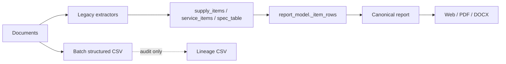
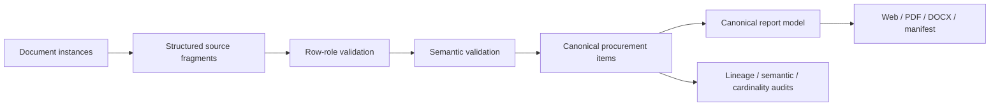

# Source-fragment graph cutover plan

## Current

| Path | Producer | Consumer | Schema | Scope | PDF / manifest / gate |
|---|---|---|---|---|---|
| `supply_items` | `upload_service._collect_supply_items` | `preliminary_analysis`, `report_model._item_rows` | legacy dictionaries | production | PDF: yes; manifest: indirect; gate: yes |
| `service_items` | NMCK/service extraction | `preliminary_analysis`, `report_model._item_rows` | legacy dictionaries | production | PDF: yes; manifest: indirect; gate: yes |
| `spec_table.rows` | goods/service preliminary analysis | compatibility/report fallback | display dictionaries | compatibility | PDF: legacy fallback; manifest: indirect |
| `structured_source_rows` | batch diagnostics | CSV audit | CSV | audit-only | no |
| `structured_source_reconciliation` | batch diagnostics | CSV audit | CSV | audit-only | no |
| canonical report | `report_model.build_procurement_report_model` | Web/PDF/DOCX | JSON model | production | yes / source of current manifests |

## Target

## Cutover constraints

- `ProcurementSourceGraph` is built once per run from document instances.
- Canonical items have exactly one validated primary fragment; rejected and ambiguous fragments cannot become confirmed report lines.
- Legacy collections may remain only as adapters feeding fragments during migration. They must not be read by the report-item builder.
- A single `production_model_hash` is emitted by canonical JSON and all render/audit artifacts.
